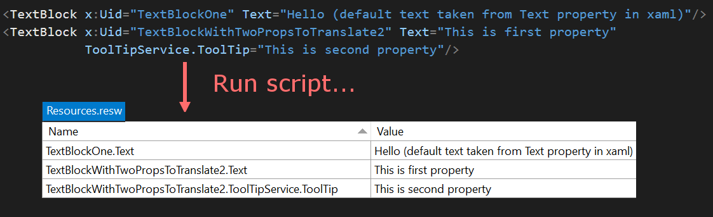
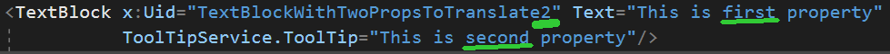

# Resource Extractor

Extracting resources one by one is nasty. This script makes it easy:



## How to use it

1. Edit `resourceExtractor.fsx` to match folder of your project and path to `Resource.resw` file. Create folder `Strings\en-US` if not exits.

    ``` fsharp
    let folderToDeepSearchForFiles = __SOURCE_DIRECTORY__  + @"\ResourceExtractorSampleApp\ResourceExtractorSampleApp"
    let finalResourceFilePath =  folderToDeepSearchForFiles + @"\Strings\en-US\Resources.resw"
    ```

2. Respect some necessary conventions:
   - Place properties, that you want to extract, after the `x:Uid` property. Last character of the `x:Uid` matches number of subsequent properties to be extracted. If last character is not a number, only one subsequent property will be taken.

   

   - For extracting resources from .cs files use `ReousrceLoader`. "TextFromCSharpCode" string will be taken as resource name and comment as default value: 

    ``` csharp
    ResourceLoader.GetForCurrentView().GetString("TextFromCSharpCode");//This default text is placed in comment in MainPage.xaml.cs`
    ```
3. Run F# script. Note that existing `en-US\Resource.resw` file will be overwritten.For complete example, see sample UWP app.

## Limitations

- There are only two possible outputs:
  - Rewritten `en-US\Resource.resw` file.
  - Error in terminal.
- Script does not create folder structure for you (`Strings\en-US\`).
- `en-US\Resource.resw` created by script is not automatically included in UWP project (you need to include it in project just once)

## Contributing

If you have any idea how to make script or sample app better, feel free to submit issue or pull-request.
